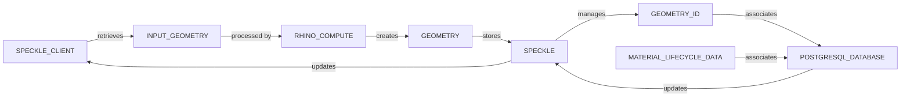
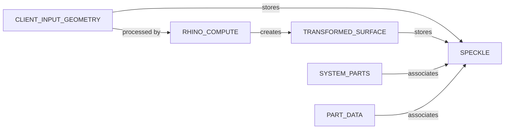

# Unlocking Business Intelligence through Compute Version Control

_En el sector de Arquitectura, Ingeniería y Construcción (AEC) falta la flexibilidad presente en
disciplinas como el desarrollo de software, donde se pueden importar y usar librerías específicas
fácilmente.
Este proyecto busca desarrollar una herramienta que permita a arquitectos y diseñadores probar
rápidamente las soluciones constructivas de los fabricantes. Además, los fabricantes podrán obtener
información sobre el uso de sus productos y las necesidades de los clientes._

<video width="100%" controls>
  <source src="src/static/assets/compute_vsc.mp4" type="video/mp4">
  Your browser does not support the video tag.
</video>


## Overview

`Compute Version Control` (VSC) aims to provide a comprehensive version control system that
validates
design proposals based on design and constructive system constraints. These constraints are provided
by manufacturers and return essential information about the lifecycle of materials and associated
data. The solution is designed to streamline project management and enhance decision-making by
ensuring designs meet both technical and regulatory requirements.

## Benefits and Business Intelligence

This system offers several benefits and unlocks numerous possibilities from a business intelligence
perspective:

- **Enhanced Decision-Making**: Detailed insights into the lifecycle of materials and their
  associated data allow businesses to make informed decisions regarding material selection and
  project planning.
- **Cost Efficiency**: Identifying cost-effective materials and construction processes can lead to
  significant cost savings.
- **Improved Compliance**: Ensures that all design proposals adhere to manufacturer-provided
  constraints, improving compliance with industry standards and regulations.
- **Data-Driven Insights**: Integration with PostgreSQL and Speckle provides robust data management
  and retrieval, enabling businesses to gain valuable insights into project performance and material
  usage.
- **Streamlined Workflow**: Automates validation and management of design proposals, reducing manual
  effort and increasing efficiency.
- **Scalability**: The modular architecture allows for easy scalability to accommodate growing
  business needs.

## System Components

The application consists of three primary components:

1. **Rhino Compute**: Handles predefined manufactured systems. It generates constructive solutions,
   such as creating glass facades from provided input surfaces.
2. **Speckle**: A data repository model that provides storage for baked geometry. Speckle is
   particularly useful for managing geometry IDs, variations, and provides tools for filtering and
   differentiation.
3. **PostgreSQL Database**: Associates geometry IDs with lifecycle data, providing efficient data
   tracking and retrieval.

This project delivers a robust solution for managing and validating design proposals, enhancing
accuracy and efficiency by leveraging manufacturer-provided constraints.

## Architecture Overview



In this diagram:

- `RHINO_COMPUTE`: Represents the component responsible for generating geometry.
- `GEOMETRY`: Represents the output geometry from Rhino Compute.
- `SPECKLE`: Stores and manages the created geometry.
- `GEOMETRY_ID`: The unique ID of each piece of geometry managed by Speckle.
- `POSTGRESQL_DATABASE`: Associates geometry with lifecycle data.
- `MATERIAL_LIFECYCLE_DATA`: Represents the lifecycle information of each material.

## Table of Contents

- [Project Structure](#project-structure): Organization of the project, including main files,
  languages, and frameworks.
- [Speckle Structure](#speckle-structure): Details of the Speckle data repository for managing
  geometry.
- [Database Structure](#database-structure): Explanation of the database's role in managing
  construction project data.

## Project Structure

The project is composed of two Docker containers: one for the Node.js project (Rhino Compute server)
and one for the Python project (Dash application). Both containers communicate within the same
network.

- **Node.js Project**: Rhino Compute server, responsible for generating geometry data.
- **Python Project**: Dash application that interacts with the Node.js project, providing a user
  interface for visualization.

```plaintext
vsc-compute-dash
└── src
    ├── callbacks
    │   ├── callback_compute.py
    │   ├── callback_speckle.py
    │   └── callback_views.py
    ├── config
    │   ├── logs.py
    │   └── settings.py
    ├── utils
    │   ├── utils.py
    │   └── utils_speckle.py
    ├── views
    │   ├── default_components.py
    │   └── layout_landing.py
    └── __init__.py
    └── core_callbacks.py
├── compute.db
├── Dockerfile
├── main.py
├── README.md
└── requirements.txt
```

In detail:

- `src/callbacks/callback_compute.py`: Defines callbacks and API endpoints for a Dash and Flask app
  to manage slider interactions, update stores, send data to a compute server, and manage SQLite
  database operations.
- `src/callbacks/callback_speckle.py`: Defines callbacks for a Dash app interacting with Speckle
  data, handling user inputs, updating data stores, merging commits, and updating UI components to
  reflect user selections.
- `src/callbacks/callback_views.py`: Defines callbacks for managing the interactive UI elements in a
  Dash app, such as toggling visibility of sidebars and collapsible sections based on user
  interactions.
- `src/utils/utils_speckle.py`: Contains utility functions for interacting with the Speckle API,
  managing construction model data, processing commits, and integrating version control features
  into project workflows.

## Speckle Structure

Speckle provides storage for all baked geometry and is useful for managing geometry IDs and their
variations. The Speckle iframe is used to display geometry and its variations in the Python project,
with the Python container connected to the Speckle server.

- **Geometry**: Created by Grasshopper and Rhino Compute.
- **System Parts**: Components associated with the geometry.
- **Part Data**: Data linked with each system part.
- **Metadata**: Additional data about geometry.

Further Steps:

- Deploy Speckle in a separate container (Windows VM).
- Update the IP address of `compute.rhino3d.appserver` to match that of the Flask application.
- Resolve the Speckle read component failure in Grasshopper and add the ability to select branches.



In this diagram:

- `CLIENT_INPUT_GEOMETRY` represents the client's input geometry, such as a surface of a facade.
- `RHINO_COMPUTE` represents the Rhino Compute component that processes the client's input geometry
  and creates the
  transformed surface.
- `TRANSFORMED_SURFACE` represents the new surface created by Rhino Compute.
- `SYSTEM_PARTS` represents the parts of the system that are associated with the transformed
  surface.
- `PART_DATA` represents the data associated with each part of the system.
- `SPECKLE` represents the Speckle component that stores the transformed surface, the system parts,
  and the part data.

## Database Structure

This project uses SQLite3 (local) and PostgreSQL as the primary database systems to store and manage
construction project data.

- **Storing Geometry Data**: PostgreSQL stores geometry created by Rhino Compute, with each geometry
  piece assigned a unique ID managed by Speckle.
- **Storing Parameter Variations**: Stores variations in parameters for constructive systems,
  tracking user changes.
- **Storing Constructive System Data**: Stores information about constructive systems, allowing
  tracking of their usage in projects.

Further Steps:

- **Associating Geometry with Material Lifecycle Data**: PostgreSQL associates geometry with
  lifecycle data, enabling material tracking throughout the project lifecycle.
- **Storing User Data**: Stores user information, tracking project ownership and parameter
  variations.
- **Storing Construction Project Data**: Manages construction project details, including ownership,
  timelines, and associated constructive systems.

## Conclusion

Compute Version Control offers a powerful solution for managing and validating design proposals,
enhancing the efficiency and accuracy of the design process. By leveraging the combined capabilities
of Rhino Compute, Speckle, and PostgreSQL, the system provides a comprehensive approach to version
control and lifecycle management in construction projects.
