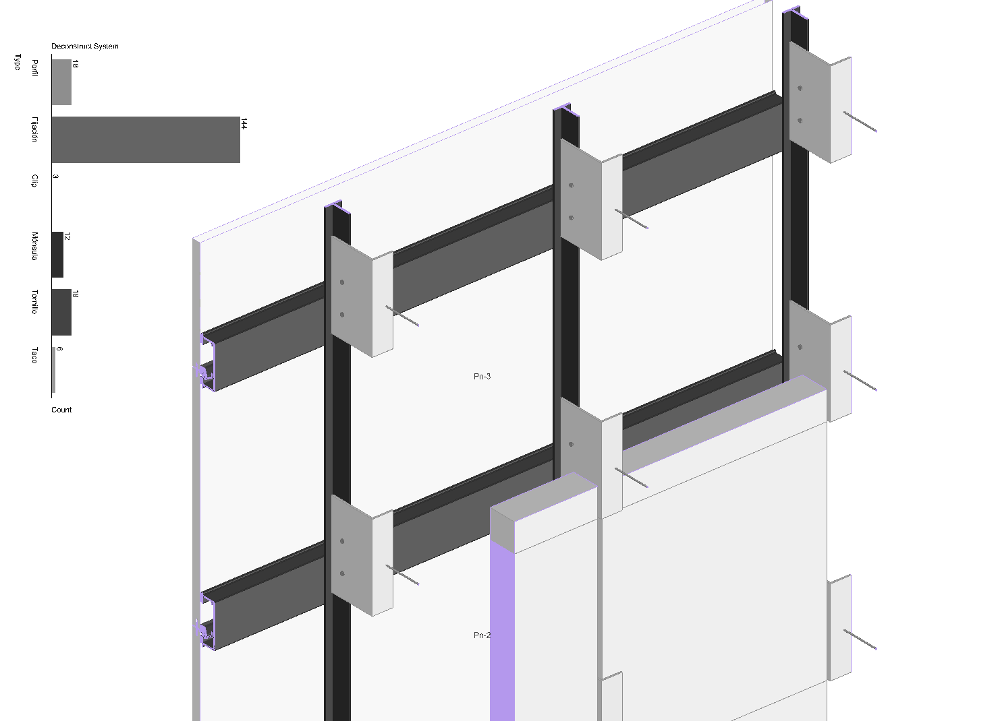

# Unlocking Business Intelligence for AEC Manufacturers with Compute Version Control


**Compute Version Control (VSC)** is an innovative tool that enhances flexibility in the
Architecture, Engineering, and Construction (AEC) sector. It allows architects and designers to
quickly test parametric manufacturer solutions directly within their preferred tools. By integrating
manufacturer-provided constraints, VSC validates design proposals and delivers essential information
on cost, material specifications, geometrical constraints, and lifecycle data. This enables informed
decision-making and ensures compliance with industry standards.

VSC also provides manufacturers with valuable business intelligence by offering insights into how
their products are used and understanding customer needs. The system leverages Rhino Compute for
geometry generation, Speckle for version control and data management, and a relational database for
associating geometry with lifecycle data. This integrated approach streamlines workflows, enhances
efficiency, and contributes to more sustainable and cost-effective construction solutions in the AEC
industry.

https://github.com/user-attachments/assets/80194026-07dd-47c5-b0f2-0c975b7fa086

*Figure 1: Landing page of the Webapp. You can see the Compute and Speckle window and the params
to interact with.*

### Business Intelligence

- **Enhanced Decision-Making**: Access to detailed material lifecycle data allows for better
  material selection and project planning.
- **Improved Compliance**: Ensures designs meet manufacturer constraints and industry regulations.
- **Data-Driven Insights**: Robust data management enables valuable insights from project
  interactions.
- **Streamlined Workflow**: Automates design validation and management, reducing manual effort.
- **Scalability**: Modular architecture easily scales with growing business needs.

### Architecture Proposal

The application comprises three main components:

1. **Rhino Compute**: Generates constructive solutions by handling predefined manufactured systems.
2. **Speckle**: Acts as a data repository for storing geometry, managing IDs, variations, and
   providing filtering tools.
3. **Relational Database**: Associates geometry IDs with lifecycle data for efficient tracking and
   retrieval.

This robust solution enhances accuracy and efficiency in managing and validating design proposals by
leveraging manufacturer-provided constraints.


*Diagram 1: General Architecture Proposal to interact with Compute and the clients BI using
Speckle.*

In this diagram:

- `RHINO_COMPUTE`: Represents the component responsible for generating geometry.
- `GEOMETRY`: Represents the output geometry from Rhino Compute.
- `SPECKLE`: Stores and manages the created geometry.
- `GEOMETRY_ID`: The unique ID of each piece of geometry managed by Speckle.
- `POSTGRESQL_DATABASE`: Associates geometry with lifecycle data.
- `MATERIAL_LIFECYCLE_DATA`: Represents the lifecycle information of each material.

### Table of Contents

- [Overview](#overview): Summary of the project's objectives and benefits.
- [Benefits and Business Intelligence](#benefits-and-business-intelligence): Explanation of the
  benefits and business intelligence insights provided by the system.
- [Architecture Approach](#architecture-approach): Overview of the system's architecture and
  components.
- [Project Structure](#project-structure): Organization of the project, including main files,
  languages, and frameworks.
- [Rhino Compute](#rhino-compute): Explanation of the Rhino Compute service and its role in
  generating geometry data.
- [Speckle Systems](#speckle-systems): Explanation of the Speckle system and its role in managing
  geometry data.
- [Database Configuration](#database-configuration): Details on the database configuration and its
  role in storing and managing construction project data.
- [Conclusion](#conclusion): Summary of the project's objectives and benefits.

## Project Structure

The project is composed of two Docker containers: one for the Node.js project (Rhino Compute server)
and one for the Python project [DASH](https://dash.plotly.com/) web application . Both containers
communicate within the same
network.

- **Grasshopper Project**: The main tool for creating the geometry and the logic of the building.
- **Node.js Project**: Rhino Compute server, responsible for generating geometry
  data.
- **Python Project**: Dash application that interacts with the Node.js project, providing a user
  interface for visualization.

```plaintext
vsc-compute-dash
└── src
    ├── callbacks
    │   ├── callback_compute.py
    │   ├── callback_speckle.py
    │   └── callback_views.py
    ├── config
    │   ├── logs.py
    │   └── settings.py
    ├── utils
    │   ├── utils.py
    │   └── utils_speckle.py
    ├── views
    │   ├── default_components.py
    │   └── layout_landing.py
    └── __init__.py
    └── core_callbacks.py
├── compute.db
├── Dockerfile
├── building.gh
├── main.py
├── README.md
└── requirements.txt
```

In detail:

- `src/callbacks/callback_compute.py`: Defines callbacks and API endpoints for a Dash and Flask app
  to manage slider interactions, update stores, send data to a compute server, and manage SQLite
  database operations.
- `src/callbacks/callback_speckle.py`: Defines callbacks for a Dash app interacting with Speckle
  data, handling user inputs, updating data stores, merging commits, and updating UI components to
  reflect user selections.
- `src/callbacks/callback_views.py`: Defines callbacks for managing the interactive UI elements in a
  Dash app, such as toggling visibility of sidebars and collapsible sections based on user
  interactions.
- `src/utils/utils_speckle.py`: Contains utility functions for interacting with the Speckle API,
  managing construction model data, processing commits, and integrating version control features
  into project workflows.

> [!IMPORTANT]
> The aim of this project is developing a minimum viable product (MVP) to test the interaction
> and the link with the Business Intelligence (BI) of the manufacturers.
> Only the [Dolcker & Clip](https://dolcker.es/dolcker-system#descargas) system by Dolcker has been
> implemented.
> The project is only tested on a local machine and is not yet deployed to a production server
> (Speckle Server, Rhino Compute).

### Input Data

The input data for the project consists of a surface representing the facade of a building. This
is a black ceramic with vertical textures. I need to adapt the default Dolcker & Clip system to
mimic the facade's texture and color.

<p align="center">
  
  
</p>


*Figure 2: Reference image of the facade to be replicated in the Dolcker & Clip system and the
model image.*

### User Interface

The main focus of this repository is to provide a user-friendly interface for architects to
import their facade designs and test with the manufacturers' systems.
The user interface consists of three primary sections: the landing page and two side panels.

- **Landing Page**: Features a split-screen view showcasing the model stored in Speckle alongside
  the model generated by Rhino Compute. Users can adjust parameters to interactively modify the
  model, with updates reflected in real-time.

- **Speckle Optimal Commit Panel**: Displays relevant metadata of the model and allows users to
  filter and select specific commits based on chosen parameters, providing insights into the most
  suitable versions.

- **Speckle Parts Panel**: Lists individual model components, including part counts per group. It
  offers detailed information for each component, such as cost, material, and lifecycle data, giving
  users a comprehensive overview of the model's structure.

## Main Systems

### Rhino Compute

This service provides a cloud-based, `stateless REST API` for performing geometry calculations on
various objects like points, curves, surfaces, meshes, and solids. The solution supports integration
with Rhino/Grasshopper plugins and allows
serialization of operations through `Grasshopper or Python scripts`.

The script hosted in
the [compute.rhino3d.appserver](https://github.com/mcneel/compute.rhino3d.appserver) repository has
unique input and output
characteristics. Both use
Speckle components to read and send working versions. The key components are:

- Read Component: Retrieves geometry from the Speckle server.
- Manufacturer Geometrical Logic: Generates geometry based on manufacturer constraints.
- Send Component: Sends geometry to the Speckle server.
- Visualize Component: Displays geometry in the appserver.


*Figure 2: Visualization of the Dolcker Constructive System in the application (view from the
wall to the outside -insulation, angular, t vertical profile, dolcker horizontal profile, panel-).*


*Figure 3: Grashopper Script used inside the Appserver repository (profile definition, input
surface, tridimensional constructive system).*


> [!TIP]
> **Parametric vs. Block**: Defining the geometrical logic of the systems allows not only the
> placement of identical blocks in different positions, but also the creation of an informed system
> based on input geometrical constraints.

### Speckle Systems

[Speckle](https://speckle.systems/) provides a `version control system` for all baked geometry and
is useful for managing
geometry, associated data and
their
variations. The Speckle iframe is used to display geometry and its variations in the web
application.

Speckle plays a crucial role in the project by managing client input geometry, building the
infrastructure to store its data along with associated metadata, and providing an intuitive way to
interact within its python integration. Additionally, Speckle facilitates storing the
output geometry and metadata from the Rhino Compute service, allowing this updated information to be
returned to the **original tool where the client is working**.

- **Input Geometry**: Input geometry provided by the client through Speckle from any software, 
  in this example the facade surface was created using Grasshopper.
- **Manufacture Constructive System**: Parametric constructive systems generated by Rhino
  Compute. Capable of handling different geometrical constraints.
- **Metadata**: Additional data about the manufacture system associated to the client geometry.

Further Steps:

- Resolve the Speckle read component failure in Grasshopper.
- [Deploy the Speckle Server](https://speckle.guide/dev/server-manual-setup.html)


*Diagram 2: Specific interaction login within Speckle service.*

In this diagram:

- `CLIENT_INPUT_GEOMETRY` represents the client's input geometry, such as a surface of a facade.
- `RHINO_COMPUTE` represents the Rhino Compute component that processes the client's input geometry
  and creates the
  transformed surface.
- `TRANSFORMED_SURFACE` represents the new surface created by Rhino Compute.
- `SYSTEM_PARTS` represents the parts of the system that are associated with the transformed
  surface.
- `PART_DATA` represents the data associated with each part of the system.
- `SPECKLE` represents the Speckle component that stores the transformed surface, the system parts,
  and the part data.

The input data is a surface that represents the facade of a building. The output data is a 3D
model of the facade with the Dolcker & Clip system applied. The **Rhino/Grasshopper connectors** by
Speckle are used to read and send the geometry data to
the [Speckle server](https://app.speckle.systems/projects/013613abb4/models/8d916b252e).


*Figure 4: Capture of the speckle web model https://app.speckle.systems/projects/74e8bc79d7.*

### Relational Database

This project uses `PostgreSQL` as the primary database systems to reflect the business logic
of the project. It stores and
manages
construction related data, users and interactions.

- **Storing Geometry Data**: PostgreSQL stores geometry created by Rhino Compute, with each geometry
  piece assigned a unique ID managed by Speckle.
- **Storing Parameter Variations**: Stores variations in parameters for constructive systems,
  tracking user changes.
- **Storing Constructive System Data**: Stores information about constructive systems, allowing
  tracking of their usage in projects.

Further Steps:

- **Associating Geometry with Material Lifecycle Data**: PostgreSQL associates geometry with
  lifecycle data, enabling material tracking throughout the project lifecycle.
- **Storing User Data**: Stores user information, tracking project ownership and parameter
  variations.

[//]: # (<details>)

[//]: # (<summary>WIP Database Proposal</summary>)


*Diagram 3: Proposed database structure for the project to enable faster and more scalable data
ingestion.*

In this diagram:

- **Users and Projects**:
    - `users` represents platform users, storing personal and account-related information.
    - `projects` represents user-created projects, including project details and descriptions.
    - `user_interactions` records interactions between users and platform elements, such as projects
      or parameter configurations.

- **Parameter Configurations and Products**:
    - `parameter_configurations` stores configurations of parameters for products within projects.
    - `parameter_configuration_products` links parameter configurations to specific product
      variants.
    - `parameter_configuration_attributes` represents selected attributes for a product in a
      configuration.
    - `products` represents the catalog of products offered by manufacturers.
    - `product_variants` represents different variants of a product, defined by attributes like
      color, finish, etc.
    - `product_attributes` defines specific attributes for products, such as features or
      specifications.

- **Product Metadata**:
    - `series` represents a grouping of products under a specific manufacturer series.
    - `colors`, `finishes`, `thicknesses`, `applications`, `systems` define different attributes,
      capturing variations offered by manufacturers.

- **Commits and Speckle Data**:
    - `commits` tracks changes made to parameter configurations, linking them to Speckle commits.
    - `speckle_models` links internal projects to their representation in Speckle, containing
      metadata.
    - `speckle_commits` represents commits within a Speckle branch, tracking changes in data.

- **Manufacturers and Elements**:
    - `manufacturers` represents companies offering products within the platform.
    - `project_elements` links specific elements of a project to products used, including quantities
      and details.

[//]: # (</details>)

> [!NOTE]
> The database structure is currently in development and will be updated in future iterations.
> The current local database is run locally in a SQLite3 file with only one table containing the
> parameters iterations and the commit message.

## Conclusion

`Compute Version Control` is a **work in progress** that offers a powerful solution for managing and
validating design proposals, enhancing the efficiency and accuracy of the design process. By
leveraging the combined capabilities of Rhino Compute, Speckle, and PostgreSQL, the system provides
a **comprehensive approach to version control and data management for iterative project designs**.
The main focus areas for the near future are:

### Next Steps

- **Ease of Use**: Enhance the user interface to create a more intuitive and user-friendly
  experience. Users will be able to select the manufacturer and system they wish to test, run
  computations, and effortlessly load the results into their preferred tools.
- **Business Intelligence**: Develop advanced analytics and reporting features to provide
  manufacturers with valuable insights.
- **Deployment**: Deploy the system to a production server to enable real-time testing and
  collaboration.
- **Performance**: Optimize the system for faster computation and data retrieval, ensuring a
  seamless user experience.
- **Scalability**: Improve the system's scalability to accommodate a growing user base and
  increasing data volumes.
