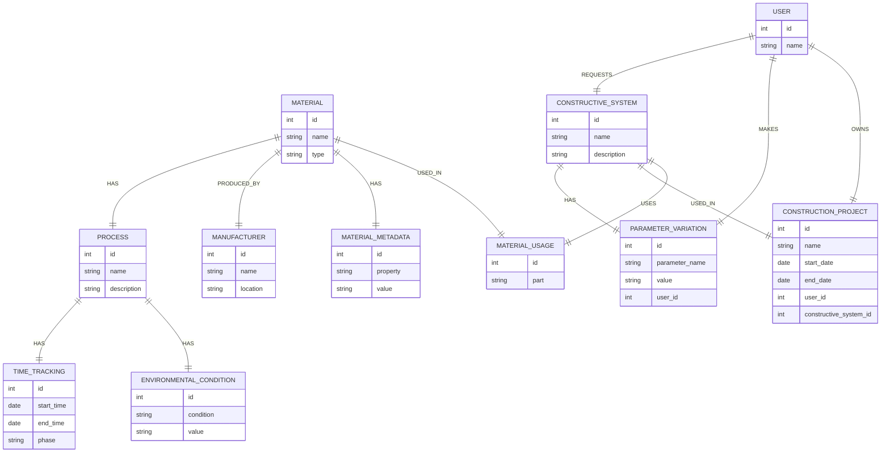

# Compute Version Control

[//]: # (![Header Image]&#40;static\readme_header.png&#41;)

[//]: # ([![Build Status]&#40;https://travis-ci.org/your-username/project-name.svg?branch=master&#41;]&#40;https://travis-ci.org/your-username/project-name&#41;)

[//]: # ([![License]&#40;https://img.shields.io/badge/license-MIT-blue.svg&#41;]&#40;https://opensource.org/licenses/MIT&#41;)

The primary aim of this project is to develop a comprehensive version control platform for Visual Studio Code (VSC) that
validates proposals based on design and constructive system constraints. These constraints are provided by manufacturers
and return information about the lifecycle of materials and their associated data.

The application is composed of three main parts:

1. **Rhino Compute**: This part handles predefined manufactured systems. It creates constructive systems from an input
   provided (e.g., a glass facade type from an input surface).

2. **Speckle**: This is the database repo model that provides storage where all the baked geometry is stored. This is
   particularly useful for managing geometry IDs and their variations. Additionally, it offers tools for differentiating
   and color filtering options.

3. **PostgreSQL Database**: This is used to associate the geometry ID and the data provided during the lifecycle
   process.

This project provides a robust solution for managing and validating design proposals based on manufacturer-provided
constraints, thereby enhancing the efficiency and accuracy of the design process.

In this diagram:

- `RHINO_COMPUTE` represents the Rhino Compute component that creates the geometry.
- `GEOMETRY` represents the geometry created by Rhino Compute.
- `SPECKLE` represents the Speckle component that stores the geometry.
- `GEOMETRY_ID` represents the unique ID of each piece of geometry managed by Speckle.
- `POSTGRESQL_DATABASE` represents the PostgreSQL Database that associates the Geometry ID with the Material Lifecycle
  Data.
- `MATERIAL_LIFECYCLE_DATA` represents the lifecycle data of each material used in the system part.

### Table of Contents

- [Project Structure:](#project-structure)
  The project structure shows the organization of the project, including the main files, languages, and frameworks used.
- [Speckle Structure](#speckle-structure)
  The Speckle structure is a database repo model that provides storage where all the baked geometry is stored.
- [Database Structure](#database-structure)
  The database structure is crucial for managing and storing data related to the construction project.

### Features

<figure>
  
  <figcaption>Rhino-Revit model sync using Speckle</figcaption>
</figure>

<figure>
  
  <figcaption>Testing facade options using Rhino Compute</figcaption>
</figure>

<figure>
  
  <figcaption>Filtering options based on the Speckle database</figcaption>
</figure>

## Project Structure

The project is going to have two docker containers, one for the Node.js project and the other for the Python project.
Both will be connected to the same network to communicate with each other.

- The Node.js project is a Rhino Compute server that computes the geometry and provides the data to the Python project.
- The Python project is a Dash application that interacts with the Node.js project (Rhino Compute server) to provide
  the interface for the user.

### Main Files

- `main.py`: This is the entry point of your application. It starts the Node.js project (Rhino Compute server) in a
  separate process and then calls the `callback_core` for interactions.

- `core_callbacks.py`: This file defines the Flask application (settings and logs) and enables CORS (Cross-Origin
  Resource Sharing), allowing endpoints from the Node.js project.

- `core_api.py`: This file defines the endpoints that interact between the Dash application and the Node.js application,
  such as `update_slider_values`.

- `utils/utils_database.py`: This file likely contains utility functions for interacting with the database.

- `readme.md`: This file provides an overview of the project, including its purpose, main features, and functionalities.
  It also includes badges for the build status and license, and sections for installation, usage, documentation,
  contributing, license, and acknowledgments.

- `constants.py`: This file likely contains constant values used across the project, such as database credentials and
  host information. The exact content is not provided.

- `utils/speckle.py`: This file contains functions for interacting with the Speckle API, such as `get_commits` (get info
  from commits - data from geometry), `access_commit_data` (returns a dictionary with
  data), `access_branch_objects`, `process_commit(s)` (reads each commit sequentially), `get_branch_names`.

- `callback_hops.py`: This file contains functions like `insert_query_local`, `retrieve_data`.

- `callback_compute.py`: The exact content is not provided.

### Languages and Frameworks

- Python: The main language used in the project.
- Flask: A Python web framework used to create the application's endpoints.
- psycopg2: A PostgreSQL database adapter for Python.
- Node.js: Used to start another project in a separate process.
- npm: A package manager for Node.js.

## Speckle Structure

The Speckle structure is a database repo model that provides storage where all the baked geometry is stored. This is
particularly useful for managing geometry IDs and their variations. Additionally, it offers tools for differentiating
and color filtering options.    
The speckle iframe will be used in the python project to display the geometry and its variations. The python container
will be connected to the speckle server to retrieve the geometry data.

In this diagram:

- `CLIENT_INPUT_GEOMETRY` represents the client's input geometry, such as a surface of a facade.
- `RHINO_COMPUTE` represents the Rhino Compute component that processes the client's input geometry and creates the
  transformed surface.
- `TRANSFORMED_SURFACE` represents the new surface created by Rhino Compute.
- `SYSTEM_PARTS` represents the parts of the system that are associated with the transformed surface.
- `PART_DATA` represents the data associated with each part of the system.
- `SPECKLE` represents the Speckle component that stores the transformed surface, the system parts, and the part data.

## Database Structure

In this project, PostgreSQL plays a crucial role as the primary database system. It is used to store and manage various
types of data related to the construction project. Here are some of its key roles:

1. **Storing Geometry Data**: PostgreSQL is used to store the geometry data created by Rhino Compute. Each piece of
   geometry is assigned a unique ID, which is managed by Speckle and stored in the PostgreSQL database.

2. **Associating Geometry with Material Lifecycle Data**: The PostgreSQL database associates each piece of geometry (
   identified by its unique ID) with its corresponding material lifecycle data. This allows the system to track the
   lifecycle of each material used in the construction project.

3. **Storing User Data**: The database stores information about the users of the system, including their IDs and names.
   This allows the system to track which user is making requests, owns construction projects, and makes parameter
   variations.

4. **Storing Parameter Variations**: The database stores the variations of parameters for the constructive systems. Each
   variation has a unique ID, a parameter name, and a value. It also stores the user ID to track which user made which
   parameter variations.

5. **Storing Construction Project Data**: The database stores information about the construction projects, including
   their IDs, names, start and end dates, user IDs, and constructive system IDs. This allows the system to track which
   user owns which construction project and which constructive system is used in each project.

6. **Storing Constructive System Data**: The database stores information about the constructive systems, including their
   IDs, names, and descriptions. This allows the system to track which constructive system is used in each construction
   project and which materials are used in each constructive system.

In summary, PostgreSQL is used to store and manage all the data in the system, making it a crucial component of the
project.

In this diagram:

- `MATERIAL` represents the materials used in construction, such as wood, concrete, and steel. Each material has a
  unique ID, a name, and a type.

- `PROCESS` represents the processes involved in the lifecycle of the materials, such as processing, manufacturing, and
  construction. Each process has a unique ID, a name, and a description.

- `MANUFACTURER` represents the manufacturers that produce the materials. Each manufacturer has a unique ID, a name, and
  a location.

- `CONSTRUCTION_PROJECT` represents the construction projects that use the materials. Each project has a unique ID, a
  name, and start and end dates.

The relationships between the entities are as follows:

- Each `MATERIAL` has one or more `PROCESS`es.
- Each `MATERIAL` is produced by one `MANUFACTURER`.
- Each `MATERIAL` is used in one or more `CONSTRUCTION_PROJECT`s.
